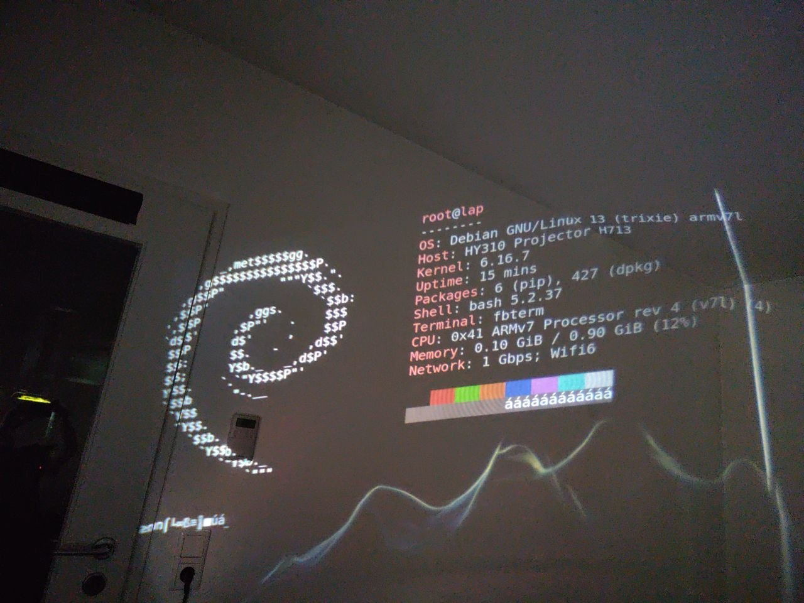

# HY310 Projector — Mainline Linux Port

[](https://ko-fi.com/well0nez)

> **Work in Progress** — This project is under active development. Many subsystems
> work reliably, but several are still being brought up and nothing has been submitted
> upstream yet. Contributions, testing, and reverse engineering help are very welcome.

<p align="center">
  
  <br>
  <em>Mainline Linux 6.16.7 running on the HY310 projector — Debian Trixie with hyfetch via fbterm</em>
</p>

## What is this?

Mainline Linux 6.16.7 port for the **HY310 portable projector** based on the
**Allwinner H713** (sun50iw12p1) SoC. The H713 is a quad-core Cortex-A53 with
1GB DDR3, a built-in MIPS display co-processor, Mali-G31 GPU, and a custom
display pipeline. This SoC is used in several affordable portable projectors
(HY310, HY300, Magcubic, and others).

The stock firmware runs Android TV on a heavily modified Linux 5.4 kernel with
proprietary Allwinner drivers. This project replaces the stock kernel with
mainline Linux 6.16.7, written from scratch through extensive reverse engineering
of the stock firmware, IDA Pro analysis of binary drivers, and register-level
hardware probing on a live device.

## Board Specifications

| Component | Details |
|-----------|---------|
| SoC | Allwinner H713 (sun50iw12p1), 4x Cortex-A53 @ 1.5GHz |
| RAM | 1GB DDR3 |
| Storage | 7.3GB eMMC (Samsung KLM8G1GETF-B041), DDR HS @ 100MHz |
| WiFi | AIC8800D80 SDIO (802.11ac, 2.4/5GHz, onboard) |
| Bluetooth | AIC8800 BT 5.4 via UART1 |
| Display | MIPS co-processor driven, 1920x1080 DLP via DLPC3435 |
| Audio | Internal codec @ 0x02030000 (speaker output working) |
| USB | 3x EHCI + 3x OHCI, 1 external USB-A port |
| IR | NEC protocol IR receiver on PL9 |
| Motor | 4-phase stepper for keystone correction |
| Fan | PWM-controlled cooling fan with tachometer + NTC thermal |
| Sensors | STK8BA58 accelerometer (TWI1), DA228EC, LSM6DSR |
| Power | DC barrel jack (dedicated), reboot + poweroff working |

## How we got here

This port was built from zero with no vendor source code or documentation.

> **If you have access to an Allwinner H713 SDK (or any sun50iw12p1 BSP), please
> reach out!** Vendor documentation and source code would massively accelerate
> this port. Everything here was reverse engineered from binaries — even basic
> register documentation would help.

The process involved:

1. **Firmware extraction** — Unpacking the stock update.img to get the kernel,
   device tree, boot loader, and MIPS display firmware binaries.
2. **Device tree reverse engineering** — Decompiling the stock DTB to map all
   hardware peripherals, their register addresses, IRQ numbers, and clock IDs.
3. **IDA Pro binary analysis** — Disassembling stock kernel modules (sunxi_tvtop.ko,
   ge2d_dev.ko, snd_alsa_trid.ko, cpu_comm.ko), stock libraries (libmspsound.so,
   audio.primary.ares.so), and the MIPS display firmware (display.bin @ 0x8B100000).
4. **Register probing on live hardware** — Using devmem and custom probe tools
   to discover H713-specific register layouts that differ from documented Allwinner
   SoCs (H6, H616, D1).
5. **Iterative driver development** — Writing each driver, flashing via eMMC,
   verifying via SSH and UART, reading dmesg, fixing, reflashing. Hundreds of boot
   cycles during development.

Key discoveries that required RE and are not documented anywhere:
- H713 pinctrl uses D1-style 0x30 bank spacing (not H6-style 0x24)
- H713 MMC controller is v5.4 variant requiring stock-specific DMA reset sequence
- H713 has a 3-user Msgbox layout (not 2-user like documented Allwinner SoCs)
- Speaker audio works directly through the internal codec (MIPS DSP not required for basic playback)
- USB PHY requires bit 0 set at PMU base register (undocumented quirk)
- R_PIO PM bank GPIO requires `SUNXI_PINCTRL_NEW_REG_LAYOUT` flag — without it,
  `gpio_direction_output()` silently fails (writes go to wrong registers)

## Current Status

See [STATUS.md](STATUS.md) for a detailed per-subsystem breakdown.

### Working

These subsystems boot and function reliably:

- **Boot chain** — Stock U-Boot loads our kernel from eMMC boot_a in Android Boot v3
  format. Auto-boots in ~15 seconds to a Debian rootfs on USB stick.
- **eMMC** — Full read/write at DDR High-Speed. 26 partitions mapped.
- **USB** — All 3 host controllers working. The HY310 has one accessible USB-A port.
  Network access (SSH, flashing) is via USB-Ethernet adapter (e.g. RTL8153) or WiFi
  — there is no native Ethernet port and no USB data connection to a PC.
- **WiFi** — AIC8800D80 SDIO fully stable. 10MB+ transfers at ~1MB/s, no errors.
  Required custom MMC v5p3x driver patches and R_PIO register layout fix.
- **Bluetooth** — BT 5.4 via UART1, auto-starts at boot via systemd service.
- **Thermal + Fan** — THS sensors (tachometer via hrtimer GPIO polling, IRQ not viable on H713), (CPU ~65C, GPU ~66C), PWM fan control with
  tachometer monitoring, NTC thermistor via board management driver.
- **IR Remote** — NEC protocol via sunxi-cir + rc-core decoders. /dev/lirc0 available.
  PL9 pin mux corrected from IDA RE (mux 3, not 2). ir-keytable mapping ready.
- **RTC** — sun6i-rtc, timekeeping across reboots, NTP synced.
- **PWM** — New 8-channel driver (pwm-sun8i) for the H713 PWM controller.
  Used for fan speed and backlight control.
- **I2C** — TWI1 with STK8BA58 accelerometer detected.
- **GPADC** — 2-channel general purpose ADC via IIO subsystem.
- **LRADC** — Low-resolution ADC via IIO. Board manager reads NTC temperature
  through IIO consumer API (clean architecture, no MMIO conflicts).
- **Reboot + Poweroff** — Both working reliably.
- **Display (DRM/KMS)** — Custom DRM driver with GEM DMA scanout, PRIME buffer
  sharing with Panfrost GPU. Labwc Wayland desktop runs. See [docs/DISPLAY.md](docs/DISPLAY.md).
- **Audio** — Internal codec speaker output via Audio Hub path. Digital volume
  control (0-63) via ALSA, auto-loads at boot. See [docs/AUDIO.md](docs/AUDIO.md).

### Partially Working

Active development, functional but not complete:

- **ARM-MIPS IPC** — The full IPC protocol stack works from ARM side: routine lookup,
  semaphore acquire, shared memory write, Msgbox TX. MIPS reads the FIFO and processes
  calls. But **MIPS cannot send ACK back** because the hardware IRQ line between the
  Msgbox and MIPS INTC is not routed — the interrupt never fires. This is the
  fundamental blocker for bidirectional communication.
  See [docs/CPU_COMM.md](docs/CPU_COMM.md).

- **Keystone Motor** — Sysfs interface works, limit switch defective on test unit.
  See [docs/MOTOR.md](docs/MOTOR.md).

### Not Yet Started

These subsystems have stock hardware addresses documented but no driver work done:

| Subsystem | Address | Notes |
|-----------|---------|-------|

| IOMMU | 0x030f0000 | Provider active, ready for Cedar VPU |

| Cedar/VPU | 0x01C0E000 | Video decode (needs IOMMU consumer + RE) |

See [docs/SUBSYSTEMS_NOT_STARTED.md](docs/SUBSYSTEMS_NOT_STARTED.md) for stock
register addresses and what needs to be done for each.

## Boot Architecture

The HY310 uses a **stock Allwinner U-Boot** that cannot be easily replaced.
This U-Boot only accepts **Android Boot v3** format images (`ANDROID!` magic header).

Key design decisions:

- **Kernel command line is hardcoded in the DTS** (`chosen/bootargs`). U-Boot
  ignores the boot image header cmdline on this platform, and we intentionally
  do not want any external component overriding our boot parameters. If you need
  to change boot arguments, edit `dts/sun50i-h713-hy310.dts` and rebuild.
- `CONFIG_ARM_APPENDED_DTB=y` is required because stock U-Boot crashes when
  trying to pass a separate DTB.
- The boot image is split into 4MB chunks (`mboot32.00`, `mboot32.01`) for
  U-Boot's fatload size limitation.
- U-Boot loads the MIPS display firmware into reserved memory **before** the
  kernel starts — the MIPS co-processor is already running when Linux boots.
- U-Boot env_a must be patched to add `usb start` to bootcmd (for USB PHY init).
  See [sunxi-env-patcher](https://github.com/well0nez/sunxi-env-patcher).

See [docs/BOOT.md](docs/BOOT.md) for the full boot flow and
[FLASHING.md](FLASHING.md) for flashing instructions (eMMC permanent + USB rescue).

## Quick Start

See [BUILDING.md](BUILDING.md) for full build instructions.

```bash
# 1. Get vanilla kernel
wget https://cdn.kernel.org/pub/linux/kernel/v6.x/linux-6.16.7.tar.xz
tar xf linux-6.16.7.tar.xz

# 2. Apply patches (16 patches, all verified clean)
cd linux-6.16.7
for p in $(cat ../allwinner-h713-linux/patches/series); do
    patch -p1 < ../allwinner-h713-linux/patches/$p
done

# 3. Configure and build
cp ../allwinner-h713-linux/config/hy310_defconfig arch/arm/configs/
make ARCH=arm CROSS_COMPILE=arm-linux-gnueabi- hy310_defconfig
make ARCH=arm CROSS_COMPILE=arm-linux-gnueabi- -j$(nproc) zImage modules

# 4. Build out-of-tree modules (audio, display, wifi)
../allwinner-h713-linux/scripts/build_modules.sh .

# 5. Build device tree
../allwinner-h713-linux/scripts/build_dtb.sh .

# 6. Create Android Boot v3 image
python3 ../allwinner-h713-linux/scripts/repack_boot.py
```

See [FLASHING.md](FLASHING.md) for how to flash the image to eMMC or boot from USB.
See [ROOTFS.md](ROOTFS.md) for creating a Debian rootfs with all modules installed.

## Repository Structure

```
dts/            Standalone device tree source (sun50i-h713-hy310.dts)
dt-bindings/    Clock and reset ID headers for H713 CCU
config/         Kernel defconfig, module autoload, optional desktop configs
patches/        16 patches against vanilla linux-6.16.7 (with series file)
drivers/        Out-of-tree kernel modules
  audio/          Internal codec, CPU-DAI, machine driver, TridentALSA bridge
  display/drm/    DRM/KMS display driver (h713_drm)
  display/ge2d/   Legacy graphics engine (superseded by DRM)
  wifi/           AIC8800D80 SDIO WiFi + Bluetooth (3 modules)
scripts/        Build, flash, and module install scripts
tools/          Debug tools (U-Boot interrupt, MIPS elog reader, env analyzer, etc.)
docs/           Per-subsystem documentation (25 files covering all HW blocks)
reference/      Stock firmware analysis (extracted DTS, kallsyms, GPIO map, env, etc.)
```

## Acknowledgments

Special thanks to the [shift/sun50iw12p1-research](https://github.com/shift/sun50iw12p1-research)
project for the early H713 research and inspiration. Their work on the HY300
(same SoC, different board) provided a valuable starting point for understanding
the H713 architecture and gave us confidence that a mainline port was feasible.
While many of their driver implementations needed substantial rework or complete
rewrites for the HY310 hardware, the initial exploration of the SoC register
space and MIPS co-processor architecture was genuinely helpful in guiding our
own reverse engineering efforts.

## Related Projects

- [sunxi-env-patcher](https://github.com/well0nez/sunxi-env-patcher) — Tool to
  patch the U-Boot environment partition with correct CRC32 checksums.

## Contributing

This is an active WIP project. If you have an H713-based device and want to help:

- **Testing** — Try the patches on your device, report what works and what doesn't.
- **Reverse Engineering** — The display pipeline and VPU (Cedar) are the biggest
  remaining challenges for full hardware support. IDA Pro analysis of `libmspsound.so` and
  `display.bin` would be extremely valuable.
- **GPU** — Mali-G31 Panfrost working (card0/renderD128). PRIME to h713_drm verified.
- **Documentation** — Stock register dumps, clock trees, and GPIO maps from other
  H713 devices help verify our findings.

## Authors

- **well0nez** — Primary developer, reverse engineering, driver porting

## License

Kernel patches and drivers: GPL-2.0 (matching Linux kernel license).
Documentation and tools: MIT.
